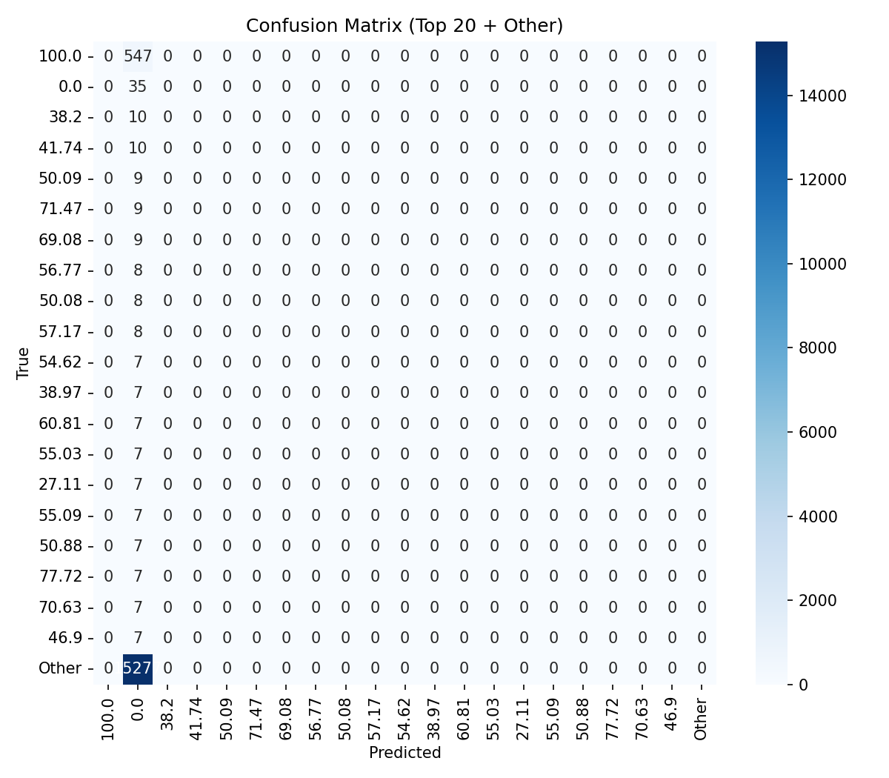

🧠 NeuroFit – AI-Powered Cognitive Fitness Tracker

NeuroFit is an AI system that predicts and tracks cognitive performance (focus, memory, reaction time) using daily activity datasets.
It provides a full ML pipeline from preprocessing → model training → saving artifacts (.h5, .pkl, .yaml, .json) → prediction with new test data.

🚀 Features

Preprocessing pipeline (numeric, categorical, text, datetime features).

Deep Learning model trained & saved as .h5.

Artifacts saved:

neurofit_model.h5 → trained model.

neurofit_preprocess.pkl → preprocessing pipeline.

neurofit_model.yaml → model architecture.

neurofit_model.json → model metadata.

Accuracy graphs & heatmaps to analyze performance.

Prediction script: takes a CSV input and outputs predictions with top-k classes/scores.

📂 Folder Structure
Neuro Fit/
│── archive/
│   └── human_cognitive_performance.csv   # training dataset
│── neurofit_model.h5                     # trained model
│── neurofit_preprocess.pkl               # preprocessing bundle
│── neurofit_model.yaml                   # model architecture
│── neurofit_model.json                   # model summary/metadata
│── training_history.csv                  # training logs (optional)
│── preds.csv                             # prediction results
│── train.py                              # training + save artifacts
│── evaluate.py                           # accuracy graph + heatmap
│── predict.py                            # standalone prediction (CLI/Jupyter)
│── README.md

⚙️ Setup
1. Install dependencies
pip install pandas numpy scikit-learn tensorflow joblib matplotlib seaborn

2. Train model & save artifacts
python train.py

This generates .h5, .pkl, .yaml, .json inside your project folder.

3. Evaluate model (accuracy graph + heatmap)
python evaluate.py

Outputs:

accuracy_graph.png

confusion_heatmap.png

4. Run Predictions

Two ways:

Option 1: CLI
python predict.py --pkl neurofit_preprocess.pkl --model neurofit_model.h5 \
                  --input test.csv --out preds.csv

Option 2: Jupyter Notebook
preds = predict_file(
    input_csv = "test.csv",
    pkl_path  = "neurofit_preprocess.pkl",
    model_path= "neurofit_model.h5",
    out_csv   = "preds.csv",
    topk      = 5,
    print_out = True,
)

📊 Example Output

Classification (top-k):

feature_1	feature_2	pred_class_1	pred_score_1	pred_class_2	pred_score_2
12	0.8	5	0.76	2	0.18

Regression:

feature_1	feature_2	prediction
12	0.8	0.674
📌 Dataset

Uses Cognitive Performance Dataset
 (reaction time, memory, attention metrics).

Place your dataset in:

C:\Users\sagni\Downloads\Neuro Fit\archive\human_cognitive_performance.csv

🎯 Roadmap

 Add mini-games (memory test, reaction test) for data collection.

 Deploy as a mobile app (React Native + FastAPI backend).

 Add lifestyle correlation (sleep, stress, exercise ↔ cognition).

 Gamification (streak badges, peer challenges).
 Author
 SAGNIK PATRA
